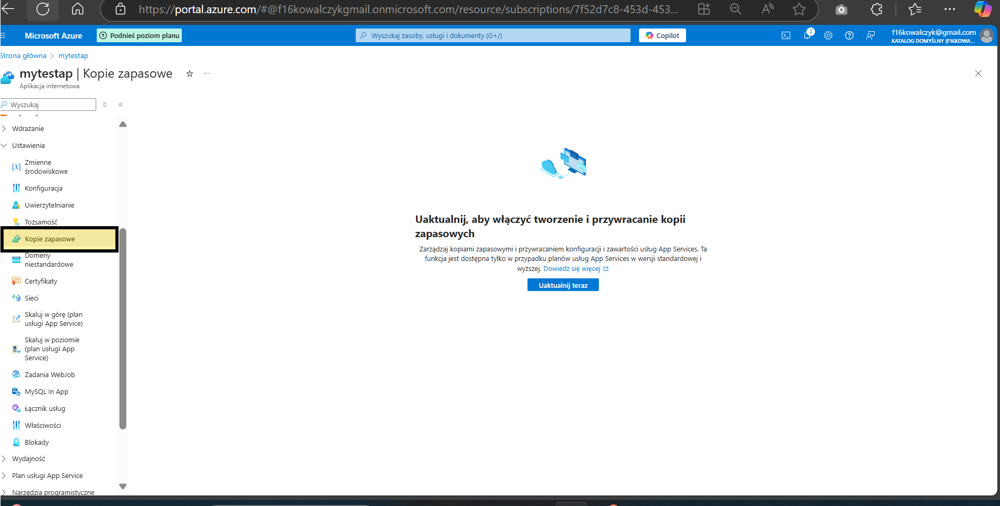
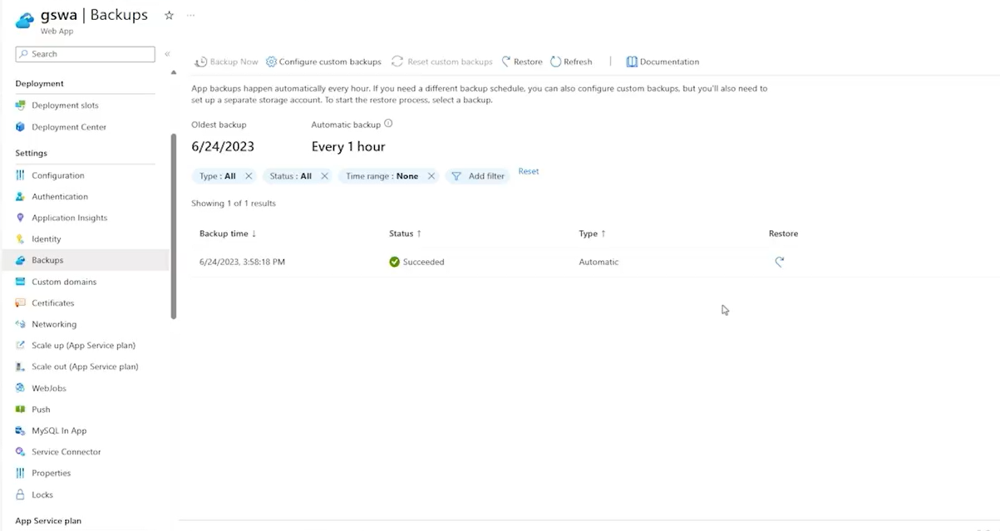
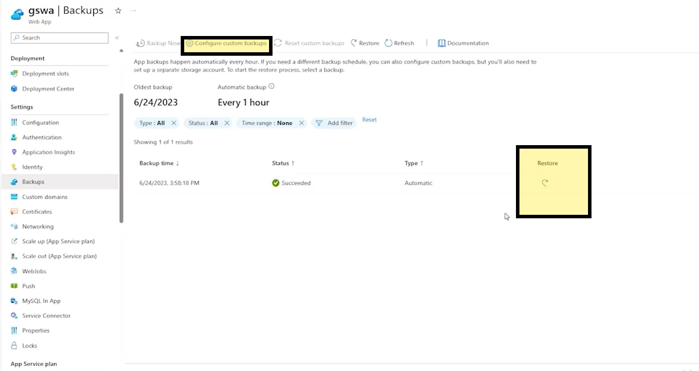
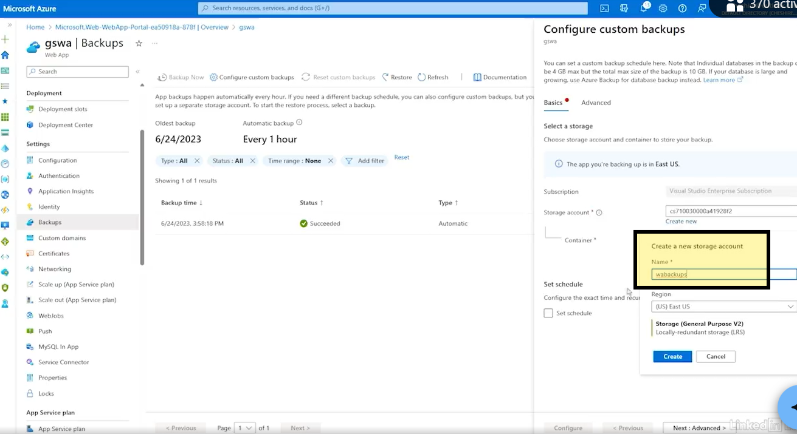
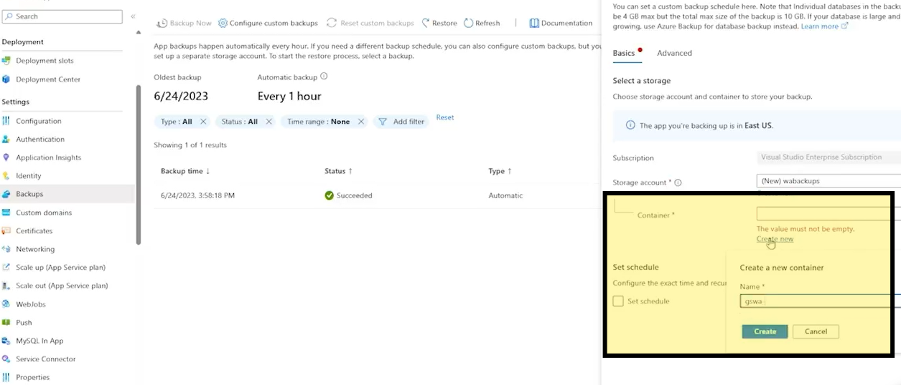
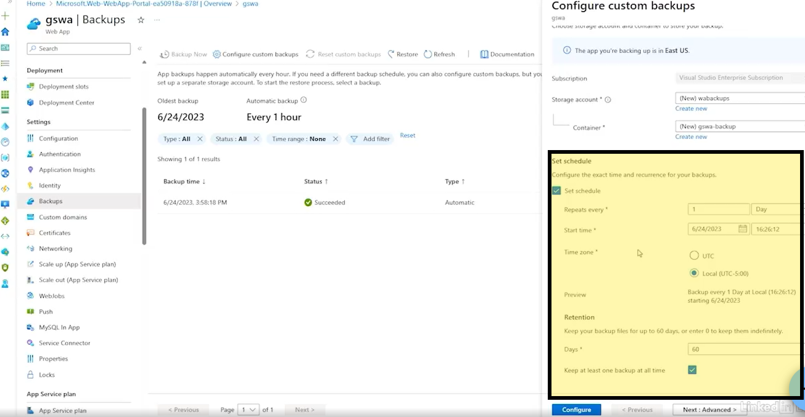
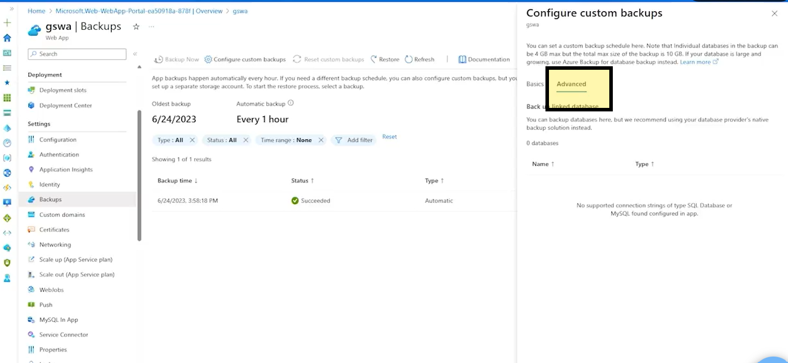

# Azure_App_backups
 How to config backups for the app?

 If you need config backups for your app go to settings next go to backups:

 

 But normaly you can see this and you can restore your backups and custom your backups.

 

 

 you can cosutom your backups and assigne storage for this:

 

 and container

 

 For schadule the backups check this:

 

 In advance setings you can add backup plan for your data base

 

